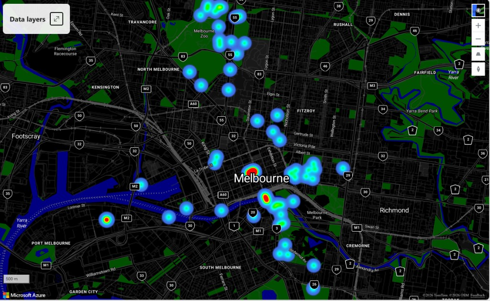

# VicRoot Fabric Soil Risk

**Urban forestry analytics on Microsoft Fabric** — Melbourne **soil sensor** data shaped through Bronze → Silver → Gold for **site- and depth-aware** moisture, temperature, and irrigation-risk signals.

---

## Portfolio pitch (recruiters & reviewers)

Slide-style narrative for interviews and LinkedIn: **[portfolio_presentation.md](portfolio_presentation.md)** — executive summary, business challenge, medallion architecture, ML baseline, and engineering practices.

**At a glance**

| Theme | Highlight |
|--------|-----------|
| Architecture | Medallion on Fabric — OneLake / Delta, PySpark notebooks, pipeline orchestration |
| Analytics | Star-schema Gold facts, peer-normalised salinity context, Power BI DirectLake story |
| Engineering | Parameter-driven [`pipeline_params.py`](notebooks/lib/pipeline_params.py), docs + dictionary, Azure Pipelines offline CI |

Technical truth tables and parameter defaults live under [`docs/`](docs/).

---

**Analytical focus:** Compare **sites** on **moisture and soil temperature** behaviour—including **shallow vs deep** (buffering, storage, decoupling) under **shared regional weather** when sensor locations are close. **Salinity (sensor EC)** is **secondary**: still materialised for context and peer screening, but not the primary narrative — see [docs/architecture.md](docs/architecture.md) *Analytical framing*.

## Map Preview

## Gold layer (star schema)

- **Dimensions:** `gold_dim_site`, `gold_dim_depth` (10–80 cm), `gold_dim_weather_daily`
- **Facts:** `gold_fact_salinity_depth_daily`, `gold_fact_moisture_depth_daily`, `gold_fact_temperature_depth_daily` (site × date × depth; day + 30d only), `gold_fact_irrigation_risk` (site × date; shallow + **deep profile** columns, moisture/temperature context, salinity tiers as secondary), `gold_fact_soil_depth_peer_daily` / `gold_site_depth_peer_summary` (weather bins + moisture-qualified **salinity** peer z-scores)
- **GeoJSON map export:** [`notebooks/04_export_site_risk_geojson.py`](notebooks/04_export_site_risk_geojson.py) (joins irrigation fact to `gold_dim_site` for lat/lon)

## Repository scope

- Fabric-ready notebooks for Bronze / Silver / Gold (+ optional ML baseline)
- Parameter-driven runtime via [`notebooks/lib/pipeline_params.py`](notebooks/lib/pipeline_params.py); split **soil** Bronze IO/API helpers in [`notebooks/lib/bronze_soil_ingest.py`](notebooks/lib/bronze_soil_ingest.py) (sync with [`01_bronze_ingest_soil.py`](notebooks/01_bronze_ingest_soil.py) in Fabric)
- Gold outputs for **moisture/temperature-led** monitoring, salinity context, and analyst-facing map visualization

## Documentation

- **[Portfolio presentation (slides narrative)](portfolio_presentation.md)**
- [Architecture & Fabric parameters](docs/architecture.md)
- [Gold data dictionary (units & grains)](docs/dic.md)
- [Power BI dashboard report — Pages 1–3, ML baseline interpretation, CI/CD path](docs/power_bi_dashboard_report.md)
- [Azure DevOps CI (offline validation, no Spark)](docs/azure-devops-fabric-ci.md)
- [Fabric pipeline activity checklist — Bronze → Silver → Gold → ML](fabric/pipeline_activity_checklist.md)
