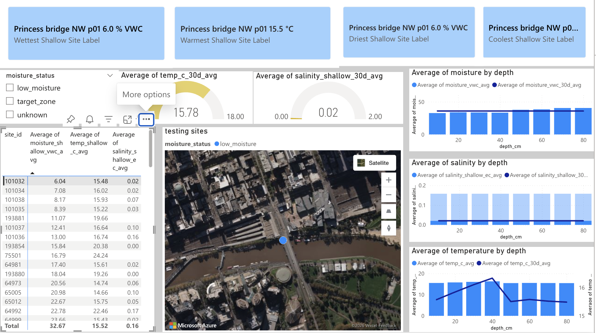
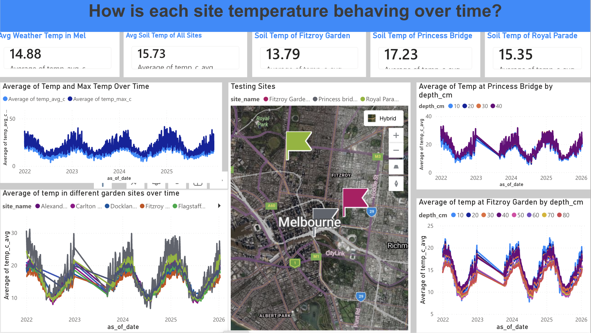
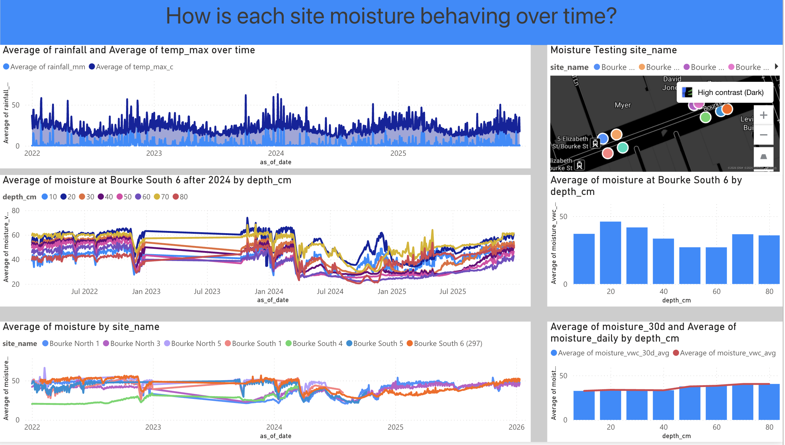

# VicRoot — Power BI dashboard insights report

# TL;DR

This report summarises **three Power BI report pages** built on VicRoot **Gold** data, documents a **baseline moisture ML** run and **how to read its metrics** (for readers who are **not data-science specialists**), and outlines **CI/CD and deployment** next steps for **Fabric + GitHub**.

---

## 1. Purpose and audience

The dashboards translate the medallion **Gold** star schema into **operational stories**: regional weather as shared context, **site-level** and **depth-level** soil moisture and temperature, and **salinity (sensor EC)** as a **secondary**, low-variance signal. The intended audience is **urban forestry / asset analysts** and **technical stakeholders** who need repeatable visuals tied to `gold_fact_irrigation_risk`, `gold_fact_*_depth_daily`, and `gold_dim_weather_daily`.

---

## 2. Data and interpretation guardrails

| Topic | Note |
|--------|------|
| **Shallow metrics** | Coalesced **10 → 20 → 30 cm** in `gold_fact_irrigation_risk` (`moisture_shallow_vwc_avg`, `temp_shallow_c_avg`, `salinity_shallow_ec_avg`). |
| **Deep profile** | **80 → 70 → 60 → 50 cm** coalesce for moisture/temperature; **deltas** (`moisture_shallow_minus_deep_vwc`, `temp_shallow_minus_deep_c`) describe vertical contrast. |
| **Cross-site vs within-site** | Cross-site comparison is fairest when sites share **similar observation dates** or the same **averaging window**. If coverage differs, **within-site, multi-depth** comparison is the stronger story. |
| **Salinity** | Values are **sensor EC proxy**, not lab **ECe**; they are **moisture-sensitive** and **low-variance** in this network — see **§7**. |

Technical detail remains in [architecture.md](architecture.md) and column definitions in [dic.md](dic.md).

---

## 3. Page 1 — Network snapshot and shallow extremes

**Role.** **Executive / triage** page: shallow **wettest, driest, warmest, coolest** sites (cards), **30-day** averages (gauges), a **per-site** table (moisture, temperature, salinity), a **map** of site locations (e.g. filtered by `moisture_status`), and **depth** visuals (moisture, temperature, salinity by `depth_cm`, including 30d rolling where used).

**How to read it.**

- **Cards** rank sites by **average shallow moisture or temperature** over the **current slicer period** (verify filters so wettest ≠ driest unintentionally when multiple sites are in scope).
- **Moisture and temperature** carry the main **spatial and temporal signal** for irrigation and heat-risk narratives.
- **Salinity** appears as a **flat, near-zero** profile on many cohorts — consistent with **secondary** use: monitor for drift, not day-to-day prioritisation.

---

## 4. Page 2 — Temperature: weather phase and garden contrasts

**Role.** Show **air temperature** (`gold_dim_weather_daily`: e.g. `temp_avg_c`, `temp_max_c`) alongside **soil temperature** by site and, for selected locations, **by depth** (`gold_fact_temperature_depth_daily`: `temp_c_avg`).

**Observed patterns (analyst narrative).**

1. **Phase with weather** — Shallow soil temperature generally **tracks** air temperature; that shared regional forcing is expected.
2. **Princess Bridge** — **Largest amplitude**: among the **coldest** soil in some cold spells and among the **hottest** in heat. Consistent with a **more exposed, thermally aggressive** microsite (e.g. hardscape / structure / limited canopy buffering).
3. **Fitzroy Garden** — **More buffered**: near peer average when **cold**; when **air is hottest**, shallow soil is **cooler** than many peers. **Depth**: in **heat**, **10 cm** is **warmest**, deeper **cooler** (shading / evaporation). In **cold**, **40 cm then 30 cm** can exceed shallower depths — **thermal inertia** (deeper soil lags surface cooling).
4. **Royal Parade** — **Intermediate** fluctuation, especially noticeable under **high** air temperature.
5. **Hot vs cold** — **Spread across sites increases when weather is hot**; under **cold** conditions, sites often **converge**, dominated by regional cooling.

**Deep-dive sites.** **Princess Bridge** and **FitzroyGarden** illustrate **opposite vertical stories** under heat — useful for teaching **microsite** effects without claiming species suitability from sensors alone.

---

## 5. Page 3 — Moisture: Bourke Street corridor

**Role.** **High-coverage** cluster along **Bourke Street**: multi-site **shallow** comparison over time and **depth-resolved** moisture (`gold_fact_moisture_depth_daily`: `moisture_vwc_avg`, `moisture_vwc_30d_avg`) for focal sites.

**Observed patterns (analyst narrative).**

1. **Same street, different moisture** — Large spread between nearby sites implies **microsite** differences (paving, tree pits, drainage, compaction, irrigation, install).
2. **Bourke South 4** — tends **driest** among the Bourke cohort in the plotted period.
3. **Bourke South 6** — historically **higher** moisture (e.g. pre-2023), then a **marked decline ~2024–2025** during **hot, dry** regional conditions, followed by **partial recovery** toward peers — coherent with **atmospheric demand and rainfall**.
4. **Vertical structure at South 6** — **10–30 cm** can sit **wetter** than **40–60 cm**; **70–80 cm** behaviour **changes over time** (e.g. **80 cm** **drier early**, later **closer to mid-profile**; **50–60 cm** **driest** in recent window; **70 cm** relatively **high** across years). Suggests **redistribution** and **depth-specific storage** worth studying with explicit hydrologic and ML features rather than visuals alone.

---

## 6. Salinity: why it is not the primary dashboard story

Empirically on Page 1 (and the wider table):

- **EC values are small** and **similar across sites** relative to the moisture/temperature range.
- **Depth profiles** are **flat** compared to moisture/temperature.

Methodologically:

- Gold stores **sensor EC proxy** (`salinity_ec_*`), **not** saturated-paste **ECe**; agronomic thresholds need calibration to instrument documentation.
- **Dry soil** depresses EC — “low EC” can reflect **moisture state**, not absence of salt risk.
- Project **intent** is **moisture- and temperature-led** monitoring and **depth buffering**; **salinity** remains **auditable** (`salinity_risk_tier`, peer tables with `ec_reading_reliable`) for **exception tracking**, not the main operational headline.

---

## 7. Limits of Power BI for “why weather drives soil”

Power BI excels at **filtering, aggregation, ranking, and comparison** over known grains (site × date × depth). It does **not**, without further modelling:

- Quantify **marginal effect** of **rainfall, ET, temperature range, humidity, wind**, or **lags** (e.g. soil response **days after** a dry spell).
- Separate **correlation from mechanism** (e.g. seasonal confounding: hot and dry together).
- Provide **predictive** distributions (“given a forecast week, moisture at depth *d*”).
- Automate **interaction** discovery (e.g. “high PET × low prior rain” regimes).

Those questions motivate **machine learning** (or **statistical models**) on curated features — not replacement of BI, but **the next layer**.

---

## 8. ML baseline (Fabric): moisture vs lagged weather

**Implementations.** Notebook [`notebooks/05_ml_moisture_baseline.py`](../notebooks/05_ml_moisture_baseline.py) joins **`gold_fact_moisture_depth_daily`** (default **30 cm**) to **`gold_dim_weather_daily`**, builds **7-day rolling** rain / evap / stress and **lag-1 moisture**, fits **Spark MLlib LinearRegression** with a **time-based train split** (`ml_train_end_date`), and writes **`gold_ml_moisture_baseline`**. Parameters are in [`notebooks/lib/pipeline_params.py`](../notebooks/lib/pipeline_params.py).

**Where to read outputs.**

| Where | What |
|--------|------|
| **Notebook log** | Lines tagged `[ML][TRAIN]` and `[ML][TEST]` (R², RMSE, coefficients). |
| **Lakehouse table** | `gold_ml_moisture_baseline` — actual **`moisture_vwc_avg`**, **`pred_moisture_vwc_avg`**, **`moisture_residual`**, feature columns, **`is_train_row`**, **`model_id`**, **`snapshot_date`**. |
| **Power BI** | Plot actual vs predicted or residual over **`as_of_date`** by **`site_id`**. |

### 8.1 Example metrics (what good numbers look like)

Illustrative run (your workspace may differ slightly):

- **Train** (rows with `as_of_date` ≤ train end): **RMSE ≈ 1.4** (% VWC), **R² ≈ 0.99**, ~24k instances.
- **Test** (after train end): **R² ≈ 0.99**, **RMSE ≈ 1.3**, ~27k instances.

**Train vs test.** Similar **test** and **train** R² usually means the simple split did **not** collapse on the holdout period — but it does **not** prove **causal** weather effects (see below).

### 8.2 Interpreting the coefficients (plain language)

The model is **linear**: each coefficient is an adjustment **holding the other inputs fixed**. **Units** mix **mm** (rain/ET over 7 days) and **°C** with **% VWC**, so **big vs small** coefficients are not compared by raw magnitude alone.

| Feature | Typical sign in baseline | Meaning |
|---------|--------------------------|--------|
| **Intercept** | Small | Mathematical baseline when inputs are zero; not a physical “true” dry point. |
| **rain_7d_mm** | Positive | More **7-day rain** → slightly **higher** predicted moisture. Often **small** because **yesterday’s moisture** already explains most of the signal. |
| **evap_7d_mm** | Negative | More **7-day ET** → slightly **lower** predicted moisture. |
| **stress_7d_mm** | Negative | 7-day sum of **ET − rain** (atmospheric moisture demand vs rain); overlaps rain and evap — **multicollinearity** is expected; do not read the three weather sums as three independent “drivers.” |
| **temp_avg_c** | Small (can be + or −) | **Air temperature** nudge after accounting for lag and rolling water balance; easily **confounded** with season — do not treat as pure “heat wets/dries soil.” |
| **moisture_lag1_vwc** | **Large (~0.9–1.0)** | **Dominant term:** today’s moisture is **almost yesterday’s moisture** plus a **small** weather correction. |

### 8.3 Why R² is so high (and what that does / doesn’t mean)

- Soil moisture at **30 cm** usually **changes smoothly** day to day, so **lag-1 moisture** alone makes the target **highly predictable** → **very high R²** is **expected**, not magic.
- The model is **useful** for: **smooth short-horizon** tracking, and **`moisture_residual`** in BI (when is the site **wetter or drier** than “yesterday + weather” suggests?).
- It does **not**, by itself, answer: “**Which weather regime** drives soil?” — the lag **soaks most variance**. For that story, later experiments might **drop** the lag, add **longer deficits**, or use **weather-only** baselines (harder task, lower R², clearer attribution).

### 8.4 Optional follow-on modelling (when you want more “weather story”)

| Idea | Trade-off |
|------|-----------|
| Fit **without** `moisture_lag1_vwc` | **Lower R²**; more emphasis on **weather-only** signal. |
| **Per-site** coefficients or regularised models | Richer **heterogeneity**, more complexity. |
| **Longer drought indices** instead of overlapping rain+evap+stress | Less redundancy, clearer narrative. |

**Evaluation discipline** stays the same: **time-based** splits, check errors **by site and season**, watch **residual drift** over new years.

---

## 9. CI/CD and deployment (Fabric + GitHub) — practical path

This section is for **shipping** the medallion + ML **reliably**, without needing deep data-science depth. **“Deploy”** here means: **versioned code**, **automated or repeatable runs**, and **documented parameters** — not necessarily k8s or a model endpoint.

### 9.1 What to put in CI (GitHub Actions)

| Check | Why |
|--------|-----|
| **Lint / format** (e.g. `ruff` or `black` on `notebooks/lib`, `src`) | Catches syntax and style before merge. |
| **Static validation** | Optional: JSON schema for `config/ge_validation_rules.json`, `fabric/*.json` templates. |
| **Secrets** | Never store API keys in repo; use **GitHub Actions secrets** only to push tokens to **non-git** systems if needed. |

**Azure DevOps:** Some Fabric trials allow **Azure Pipelines** but not GitHub Actions for the same checks. This repo includes [`azure-pipelines.yml`](../azure-pipelines.yml) and a short runbook: [azure-devops-fabric-ci.md](azure-devops-fabric-ci.md).

**Reality check:** PySpark notebooks often **do not run in GitHub-hosted runners** (no Fabric cluster). CI is usually **lightweight**: **files compile**, **params align** with docs, **no committed secrets** — full pipeline runs stay in **Fabric**.

### 9.2 What “CD” means for Fabric

| Component | Practice |
|-----------|----------|
| **Source of truth** | **Git** (GitHub): notebooks, `pipeline_params.py`, `docs/`, `fabric/` templates. |
| **Runtime** | **Fabric workspace**: lakehouse, pipelines, notebook activities. |
| **Promotion** | **Manual**: merge to `main` → pull or copy notebooks into Fabric Git sync, or paste runbook. **Automated**: **Fabric Git integration** (Azure DevOps or GitHub via workspace settings) so the workspace tracks a **branch** — varies by tenant SKU. |
| **Orchestration** | **Pipeline** chaining: Bronze → Silver → Gold → optional **`05_ml_moisture_baseline`**; **schedule** (daily/weekly) + **failure alerts**. |
| **Parameters** | Pass **`VICROOT_PARAMS_JSON`** or Fabric **notebook parameters** mirroring [`pipeline_params.py`](../notebooks/lib/pipeline_params.py) — avoid hard-coded workspace IDs in business logic. |

Start with: **one pipeline** with **notebook activities** and **clear parameter set** for `snapshot_date`, table names, `ml_train_end_date`, then add **notifications** on failure.

### 9.3 Power BI “deployment”

- **Semantic model** → **DirectLake** to Gold + `gold_ml_moisture_baseline`.
- Treat **dataset refresh** as tied to **pipeline success** (refresh after Gold/ML notebook succeeds, if your model depends on those tables).
- **Workspace** promotion (dev → test → prod) mirrors **Fabric workspace** or **capacity** strategy — often **manual** early on.

### 9.4 Suggested learning order (non–data scientist)

1. **Git branching**: `main` protected, **feature branches**, small PRs (your repo is already on GitHub).
2. **GitHub Actions**: one workflow — **checkout**, **install Python**, **ruff check** (or `python -m compileall` on shared libs only).
3. **Fabric**: **Git integration** docs (Microsoft Learn) for your org’s supported path.
4. **Pipeline**: duplicate **dev pipeline** to **prod** with different **parameters** (lakehouse name, paths), not different code.

### 9.5 VicRoot operating model (default)

For this project, **until** a wider team needs PR gates:

| Layer | Choice |
|--------|--------|
| **Code & docs** | **Git/GitHub** remains the **source of truth**; commit after meaningful notebook or param changes. |
| **Fabric content promotion** | **Fabric Deployment Pipeline** (e.g. dev → test → prod workspaces) for **reports / datasets** and other supported items where you use it. |
| **Notebook sync** | **Manual** (upload or paste from repo, or enable **Fabric Git integration** later if you want auto-sync). No requirement for **GitHub Actions** initially. |
| **Orchestration** | **Fabric data pipelines** schedule **Bronze → Silver → Gold → ML** runs in the **target** workspace. |

Revisit **GitHub Actions** or **Azure DevOps** when you need **mandatory checks on every merge** or multi-person **release discipline**.

---

## 10. Figure sources

Screenshots stored in-repo:

- [Page 1](images/page_1.png)
- [Page 2](images/page_2.png)
- [Page 3](images/page_3.png)

---

## 11. Closing

The three pages establish a **coherent monitoring narrative**: **shared weather**, **site contrasts**, and **depth profiles**, with **salinity** in a **supporting** role. A **baseline ML table** (`gold_ml_moisture_baseline`) adds **predicted moisture and residuals** for BI; **high R²** here mainly reflects **smooth moisture persistence** plus weather nudges — interpret accordingly (**§8**). **Default delivery stack:** **Git** + **Fabric Deployment Pipeline** + **manual notebook sync** (**§9.5**); add **GitHub Actions** when team process needs it.
